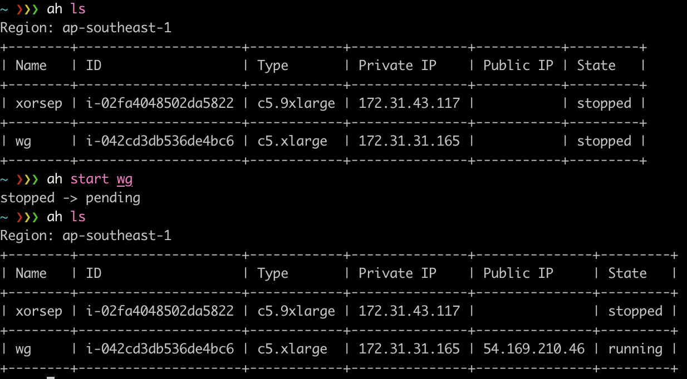

# ah

A toy AWS CLI implementation in Rust. Compared to the official AWS [CLI](https://aws.amazon.com/cli/), ah provides more succinct outputs for ease use.

I created this project just for my limited usage scenarios. Thus, I will not commit my time to maintain this project. But issues and pull requests are still welcome.

## Example

## Usage

Run `ah help` to see all.
